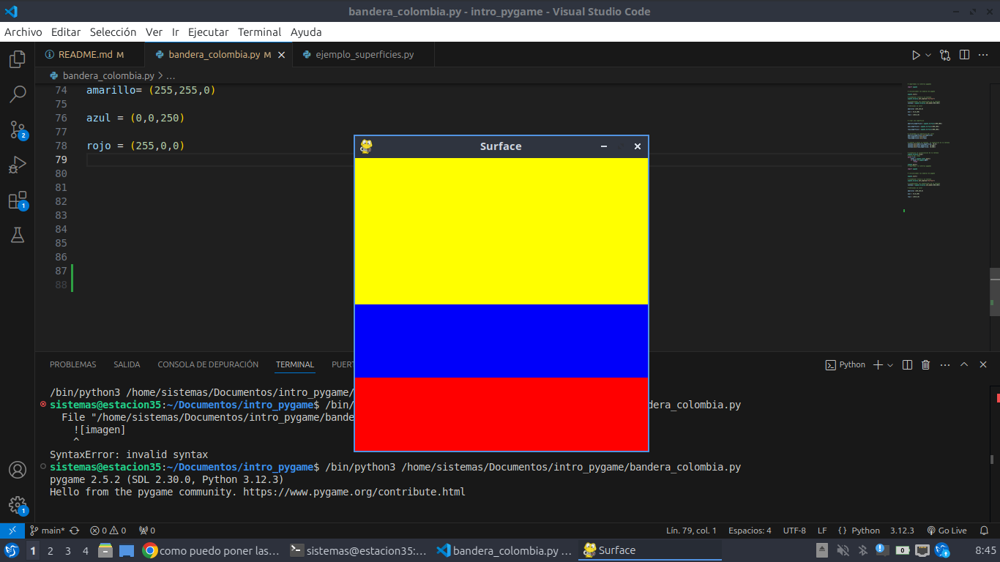

# estructura de un juego en pygame

## inicializacion

- como en todo programa en python, se debe importar los modulos o librerias a utilizar
`import pygame`

-inicializar pygame usando la funcion init (). inicializa todos los modulos de pygame importados.
`pygame.init()`

## visualizacion de la ventana 

`ventana = pygame.dislay.set_mode((600,400))`

- set mode() es la funcion encargada de definir el tamaño de la ventana. En el ejemplo. se esta definiendo una ventana de 600 px de ancho, por 400 px de alto.

`pygame.display.set_caption("Mi ventana)`

-set caption() es la funcion que añade un titulo a la ventana.

### funcion set_mode () 

`set_mode(size = (0.01),flags = 0, depth = 0,display = 0)`

-size = (600,400) : define uno o mas comportamientos para la ventana.
    - valores: 
        - pygame.FULLSCREEN
        - pygame.RESISTABLE
    - ejemplo 
        - flags = pygame.FULLSCREEN | pygame.RESIZABLE : pantalla completa, dimensiones modificables. 

## bucle de juego o game loop 

- bucle infinito que se interrumpira al cumplir ciertos criterios.

- reloj interno

- en cada iteracion de bucle del juego podemos mover un personaje, o tener en cuenta que un objeto a alcanzado a otro,o que se han cruzado la linea de llegada quiere decir que a partida ha terminado

- cada iteracion es una oportunidad para actualizar todos los datos relacionados con el estado actual dela partida

- en cada iteracion se realizan ls siguentes tareas:
    1. comprobar que no se alcanzan las condicones de parada, en cuyo caso se interrumpe el bucle.
    2. actualizar los recursos necesarios para la iteracion actual
    3. obtener las entradas de sistemas, o de interaccion del jugador
    4. actualizar todas las identidades que caracterizan el  juego
    5. refrescar la pantalla.

## superficies pygame 
- superficie: 
    - elemento geometrico
    - linea, poligono, imagen, texto que se muestra en la pantalla 
    - el poligono se puede o no rellenar de color 
    - las superficies se cean de diferente manera dependiendo del tipo:
        - image: image.load()
        - texto: font.render()
        - suoerficie generica: pygame.surface()
        - ventana de juego: pygame.display.set_mode()


 # ejemplo  bandera de colombia

 ```pygame


# importamos la libreria pygames 

import pygame


# inicializamos los modulos de pygame 

pygame.init()

# establecer titulo a la ventana 
pygame.display.set_caption("Surface")

# establecemos las dimensiones de la ventana 
ventana = pygame.display.set_mode((400,400))

# definimos un color 

amarillo= (255,255,0)

azul = (0,0,250)

rojo = (255,0,0)


# crear una superficie 

amarillo_Superficie = pygame.Surface((400,200))

azul_Superficie = pygame.Surface((400,100))

rojo_Superficie = pygame.Surface((400,100))


# rellenamos la superficie del color
amarillo_Superficie.fill(amarillo)
azul_Superficie.fill(azul)
rojo_Superficie.fill(rojo)


# inserto o muevo la ventana  la superficie en la ventana
ventana.blit(amarillo_Superficie, (0,0))
ventana.blit(azul_Superficie, (0,200))
ventana.blit(rojo_Superficie, (0,300))


# actualiza la visualizacion de la ventana 
pygame.display.flip()
# bucle del juego
while True: 
    event = pygame.event.wait()
    if event == pygame.QUIT: 
        break 

pygame.quit()
# importamos la libreria pygames

import pygame


# inicializamos los modulos de pygame 

pygame.init()

# establecer titulo a la ventana 
pygame.display.set_caption("Surface")

# establecemos las dimensiones de la ventana 
ventana = pygame.display.set_mode((400,400))

# definimos un color 

amarillo= (255,255,0)

azul = (0,0,250)

rojo = (255,0,0)

pygame.QUIT
```



# geston del tiempo y los eventos

### modulo time 

- este modulo ofrece funciones que permiten la sesion actual (desde el init) o pausar, La ejecucion, por ejemplo.
- Funciones:
    - pygame.time.get_ticks 
    - pygame.time.waitpygame.time.delay

- objeto clock
    - la funcion tick permite actualizar el reloj asociado con el juego actual.
    - se llama cada vez que se actualiza la pantalla del juego.
    - permite especificar el numero maximo de fotogramas que se muestran por segundo, y por tanto, limitar y controlar la velocidad de ejecucion del juego.
    - si insertamos en un bucle de juego la sguiente linea,garantizamos que nunca se ira mas rapido de 50 fotogramas por segundo : 
    `Clock.tick(50)`

### gestion de eventos 
- hay diferentes formas para que el programa sepa que se ha desencadenado un evento.

- es ecincial que los programas puedan conocer inmediatamente las acciones del jugador a travez del teclado,el mouse, el joystick o cualquier otro periferico

#### funcion pygame.get
- Permite obtener todos los eventos en espera de ser procesados y que estan disponibles en una cola

- si no hay ninguno,entonces una coleccion vacia.
```python
# usamos bucle for para recorrer todos los eventos de la coleccion obtenida al llamar a la funcion get. 
for event in pygame.event.get(): 
    if event.type == pygame.KEYDOWN :
        if event.key == pygame.K_ESCAPE:
            PARAR_JUEGO = True 
```

#### funcion pygame.event.wait
- Esta funcion espera a que ocurra un evento, y en cuanto sucede, esta disponible.

EJEMPLO:
```python
while True:
        event = pygame.event.wait()
        if event.type == pygame.QUIT :
            break
``` 
#### funcion pygame.event.poll
- devuelve solo uno de los eventos que estn en la cola de espera

## Sonidos en pygame
- pygame.mixer:modulo que permite la gestion del sonido.
- music : modulo que gestiona la musica de fondo. necesariamente solo hay uno a la vez 
- sound: objeto de mixer que se puede instanciar varias eces para usarlo en los efetos de sonido del juego.

## archivos de sondio
-se recomienda usar dos fromatos principalmente
    - formato WAV(Waveform audio File Format)
    - formato abierto y gratiuto OGG

### channel (canal) en pygame 
- un juego  tiene varios canales de sonido.
- se puede asignar un snido al canal numero 1 y otro diferente al numero 2.
- entonces es posible reproducir sonidos simultaneamente activando su lectura en diferetes canales 
 
## SPRITES 
- bjeto que asocia una ubicacion,una representacion grafica (esta o aquella imagen) y un conjunto de propiedades,estas propiedades pueden ser un nombre, un texto, valores booleanos que caracterizan el objeto en cuestión (por ejemplo si el objeto se puede mover o no).
- Una posible traduccion del termino sprite podria ser "imagen-objeto" que se actualiza con cada interraccion del juego
- cuando mas complejo es el juego,mas objetos graficos tiene que gestionar y actualizar lo que puede ser tedioso.
- pygame usa no solo la nocon de sprite, sino la nocion de grupo de sprites (group)
- la nocion de grupo permite agrupar los objetos del mismo tipo. ejemplo : todos los soldados de un ejercito lo que se entiende como una colceccion de instancias de una clase Soldado 

- un determindado proceso se puede aplicaar a un conjunto o subconjunto de sprites. Ejemplo: cambiar el color de todos los enemigos o hacer invisibles algunos objetos